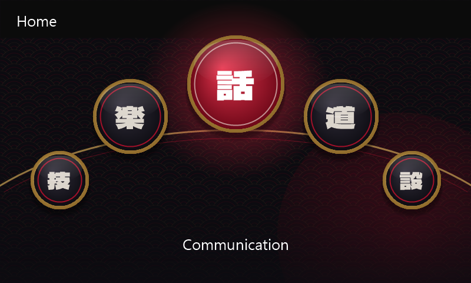

# KODO theme for the stock Mazda Connect screens

This restyles Mazda's own interface (home screen, and later lists, dialogs and now-playing), not just our apps.



*Mockup. The coin positions are estimated; on the car the stock layout places them.*

## How it works

The stock interface is HTML/CSS/JavaScript in `/jci/gui` on the CMU, drawn with PNG images. Themes (including
MZD-AIO's) replace those images at the same paths and sizes. That's why a theme alone mostly changes colors: the
layout stays Mazda's.

The redesign has three layers:

| Layer | What it changes | Status |
|---|---|---|
| **1. Artwork** | Home coins (normal and focused), the arc, the focus glow, the app-wide background | ✅ Built (`files/`), installer ready |
| **2. Layout and fonts** | Coin positions, label font and style, status bar: a stylesheet injected at startup, like the greeting | Next: class names are known from MZD-AIO's menu tweaks |
| **3. Every other screen** | Lists, dialogs, now-playing, settings | Needs the stock stylesheets: the installer copies them to the USB (`DUMP_STOCK_UI=1`) |

## Home screen

Kanji emblems stand in for the stock icons, and the stock English label still shows under the focused coin:

| Coin | Kanji | Meaning |
|---|---|---|
| Communication | 話 | talk |
| Entertainment | 楽 | enjoyment, music |
| Navigation | 道 | road, way |
| Applications | 技 | tools, craft |
| Settings | 設 | set up |

Normal coins are sumi black with a gold ring. The focused coin is Soul Red, over a red glow. The arc is a thin
gold brush stroke. The background is sumi with faint seigaiha waves and a rising sun low on the right. It's kept
subtle because the stock screens draw lists and text over it everywhere.

Rebuild the artwork with:

```
powershell -ExecutionPolicy Bypass -File tools\stock-theme\make-home.ps1
```

(needs the full fonts in `tools\.cache`; `node tools/build-theme.js` downloads them, or grab them from Google Fonts).

## Installing and undoing

`installer/tweaks.sh` has two options for this:

- `INSTALL_STOCK_THEME=1` copies `files/` over the stock files. **The first time**, each original is saved to
  `/tmp/mnt/resources/aio/kodo-stock-backup/` (never overwritten on reinstall). `UNINSTALL=1` puts every original back.
- `DUMP_STOCK_UI=1` is read-only: it copies the stock `.css`, `.js` and `.html` files to `stock-ui-dump/` on the USB.
  Bring that folder back to this repo (it's git-ignored, since it's Mazda's code) and layer 3 can begin.

Dry-run tested against a fake copy of the CMU's folders: install, reinstall and uninstall, with every stock file
restored byte-for-byte. **Not yet run on the car.**

If you already use an MZD-AIO theme, its images are what get backed up, so uninstalling brings that theme back.
